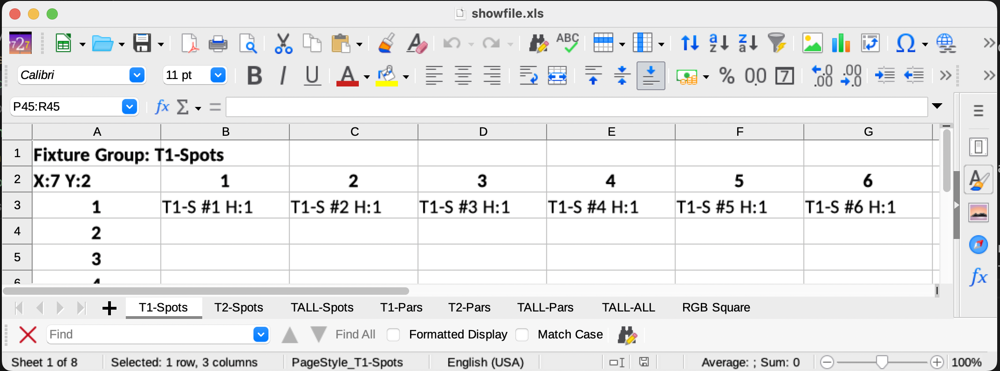

# Expand RGB Layouts

This part of the tool exports the fixture group layouts into a spreadsheet to more easily edit the locations of the assets in the group to the design you want. 

## Export

```
./bin/expand_fixture_features.py -o examples/showfile-after.qxw ./examples/showfile-before.qxw -E -x ./examples/showfile.xls
```

This will write out a file you can then open with your favorite spreadsheet editor, I like LibreOffice. In the file you'll find tabs that represent each Fixture Group with cells that match the instances of the fixture at that position



### Existing Fixture Groups
You can edit the layout of fixtures here by:

- moving the cells to the locations you want, just maintain the format of the cell name
- adding more rows and columns, just make sure you change the X and Y settings at A2 


### New FixtureGroups

You can create new groups by:

1. duplicating an existing tab and naming the group in the tab name
1. changing the name in the header on the new page
1. updating the X: Y: settings in A2 
1. copy/pasting from this or other Tabs to create the layout you want

## Import
```
./bin/expand_fixture_features.py ./examples/showfile-before.qxw -I -x ./examples/showfile.xls -o ./examples/showfile-after.qxw
```

This will create the new file with a merge of the existing file and the new Fixture Groups and Layouts. 

