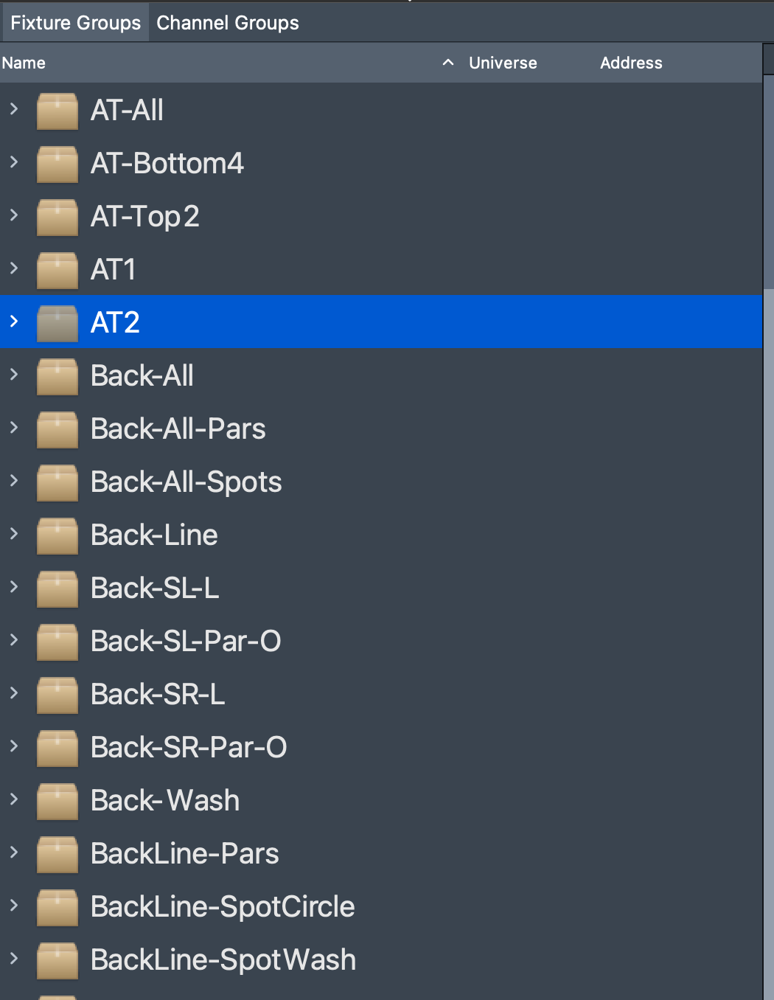
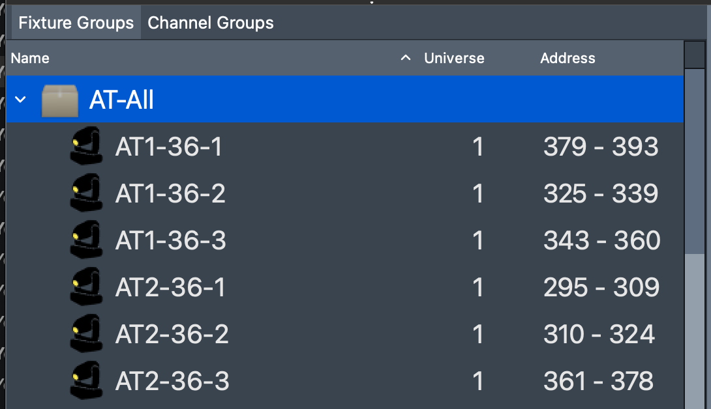
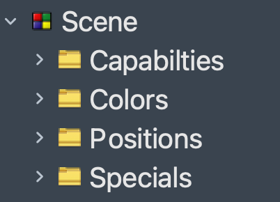
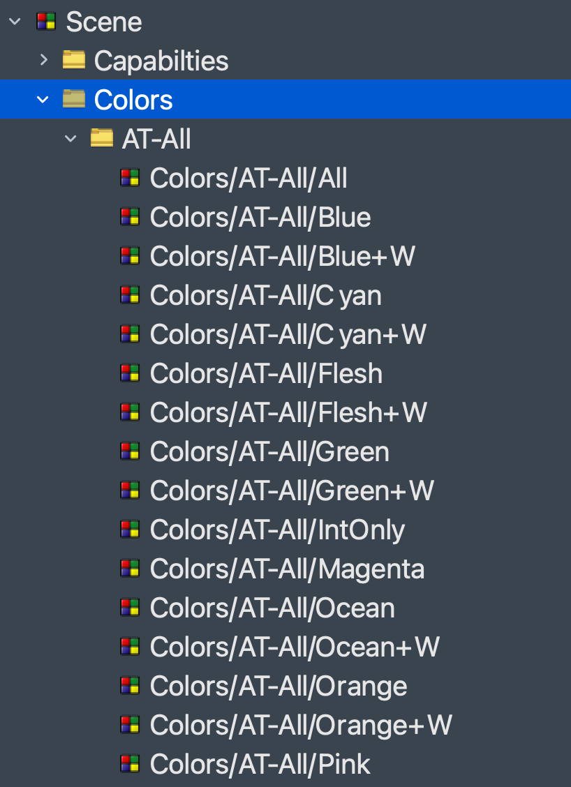
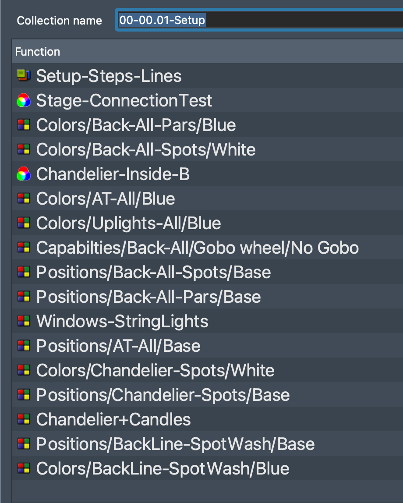
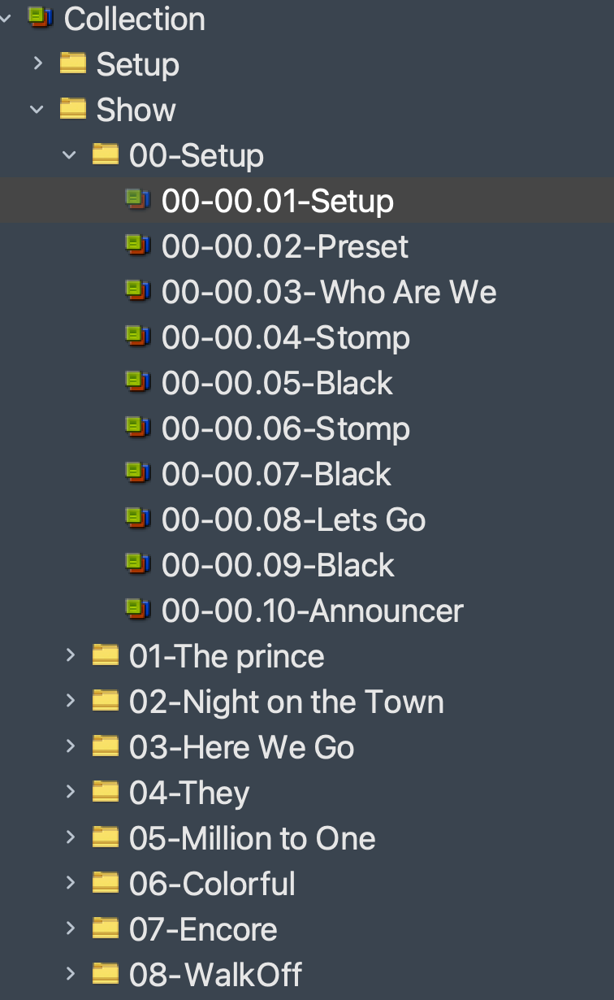
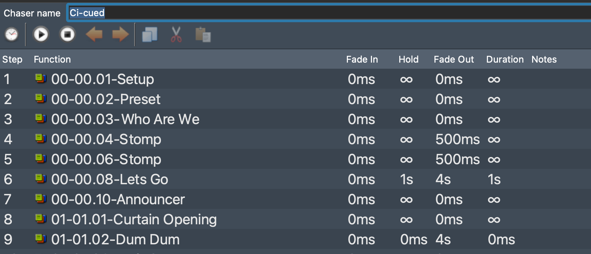
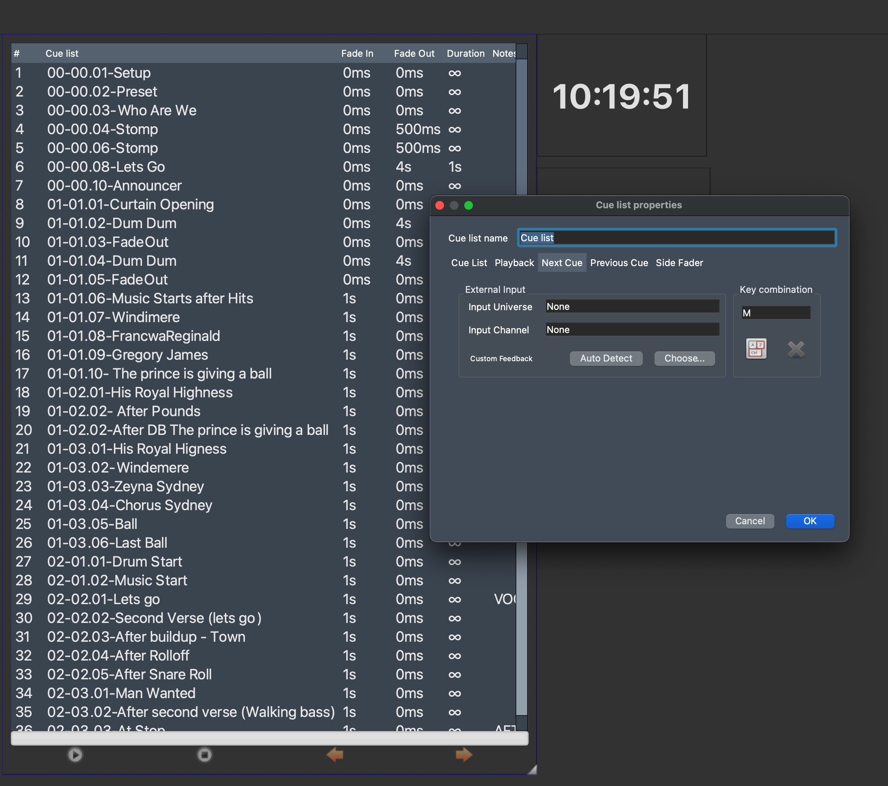

# Showfile Design

The premise of operation is that instead of making large monolithic scenes in the tool that require point editing to adapt or update, we assemble the show via combinations of settings.  In this way.. making a change to a visual scene is as simple as changing the groupings of scenes.  This also allows for easier global changes in the system.

We use "folders" in the system to organize the layout of the data, and the tool will express the entire "path" to an object in the name so that when viewing the information in the system; it's clear what's being selected at that point. 

## Fixture Groups

We use this as the basic grouping of elements on the stage.  Typically this is fixutres of same location or type or combinations; which are used together during scenes to light the show.  In QLC+ are base set of groups created automatically when generating RGBMatrix features, however any seriues of fixtures anywhere on the stage can be grouped as desired.  

If you're gonna be using these fixture sets in a chase or RGB Matrix, remember to lay them out correctly relative to their position on the stage.

## Fixture Based Scenes (FBS) 
We leverage this capability to assign "feature based scenes" to the groups so that when assembling cue-points in "chase" you can easily change the behavior of the fixtures by replacing the sets.  This also means where you're using a common feature based scene, such as a position for a head; if you need to alter that for the entire show you can make the change in 1 place and it will apply to all instances of use of the scene.

For the desigin of the software, we assume the sets needed are Capabilities (gobo, etc..), Colors, and Positions.  Specials I use as a catch all for effects or other that are DMX driven such as Relays, Fog/Haze, etc.

To create these scenes, we define some basic settings in the tool, load the existing showfile, and the tool will then automatically generate the fixture based scenes as needed.

### Organization

Sets of capablities for each fixture group are organized in to scenes that can then be used in collections to assemble the view

The path is preserved in the name to avoid collisions and allow easy reference in when viewing an entire collection.

## Collections
We leverage collections to assemble the FBS into a "view" of the stage.  Collections can include scenes, matrixes, EFX, chases, sequences, scripts and other objects.  We leverage this capability to take a single collection and assemble a set of FBSs and such to establish a view of the stage. 

In this example it's the "preset" for the show so we have all the lights on and pointed in an expected configuration so that technicians can visually verify everything is working before the show starts. 

### Organization

We organize collections by their use-case and timing in the show.   I use a cue naming format that allows easy expansion/extenssion {song}-{part}-{cue}; and song 0 is before-curtain.

## Chase

The Show is then setup to be run via cue'ing using a "Chase".  Each cue is added with timings so that it can then be used as needed.  To do this a hold time of  &infin; is generally used so that the show can be cue'd via the virtual Console Cue List. Fade in/out timings can be set here as well .. and/or using a defined holdtime and duration can "auto-cue" where it makes sense.

## Cuelist

Once you've assembled the parts, A Cuelist is used in the Virtual Console to allow the show to be cued.  Once added to the Virutal console, in the configuration we define a "Next Cue" button ( we use M ), and a "Previous Cue" button to allow the operator to move the show through time. 

